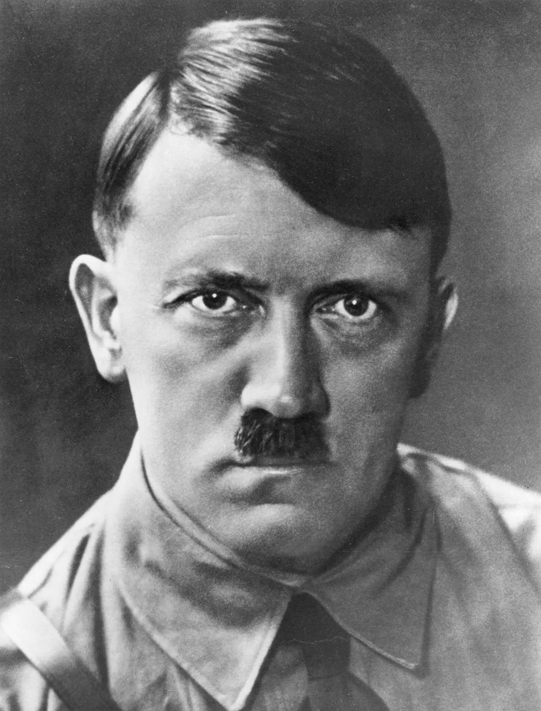

# Operation Walküre
Ein Referat von Jakob H.

---

## Allgemeine Informationen
- Erscheinungsjahr: 2008
- Länge: 120 Minuten (2h)
- Staatsstreich im 2. Weltkrieg
- gefilmt in Deutschland und Kalifornien
- mehrere Filmversionen
	- Stauffenberg / Operation Valkyrie (2004)
	- Operation Walküre - Das Stauffenberg-Attentat / Valkyrie (2008)
		- mit Tom Cruise
	- Operation Walküre - Das Hitler-Attentat (2009)

---

## Charaktere

---

|Adolf Hitler|David Bamber |
|------------|-------------|
|||

---

|Ludwig Beck|Terence Stamp|
|------------|-------------|
|||

Generaloberst

---

|Friedrich Fromm|Tom Wilkinson|
|------------|-------------|
|||

Generaloberst

---

|Friedrich Olbricht|Bill Nighy|
|------------|-------------|
|||

General

---

|Henning von Tresckow|Kenneth Branagh|
|------------|-------------|
|||

Generalmajor

---

|Claus von Stauffenberg|Tom Cruise|
|------------|-------------|
|||

Oberst

---

### Hierachie (Auszug)
- Reichsführer
	- Himmler
- Generaloberst
	- Ludwig Beck
	- Friedrich Fromm
- General
	- Friedrich Olbricht
- Generalmajor
	- Henning von Tresckow
- Oberst
	- Claus von Stauffenberg

---

## Inhalt

---

- Tunesion (Nordafrika)
- Stauffenberg erschüttert über Nazi-Verbrechen
- Stützpunkt wird angegriffen
- Stauffenberg verliert Arm und linkes Auge

---

#### Nordfront in Russland
- General Tresckow steckt Zündschnur in Whiskey
- Hitler steigt in Flugzeug
- Tresckow übergibt Flasche Oberst Brandt
- Telefonat
	- "Er ist gelandet"
- Tresckow ruft Brandt an
	- will Flasche zurückhaben
	- "falsche Flasche"

---

#### Armeekommando Berlin
- Olbricht berichtet Tresckow
	- "Operation aufgeflogen"
	- Festnahme von Oster

---

#### Armeekommando Berlin - Büro von Brandt
- Brandt erzählt von Anschlag
- angespannte Lage
- Tresckow will Flasche
- "Vielleicht sollten wir sie öffnen"?
	- => enttarnt
- "Ich habe Sie für etwas anderes gehalten"

---

- Stauffenberg redet mit Olbricht
- dieser will, dass Stauffenberg beitritt
- zögert wegen Familie

---

#### Treffen der Verschwörer

- Stauffenberg ist Osters Ersatz
- fragt Gruppe nach Plänen nach Hitlers Tod
- Hinterfragung der Eignung
- Tresckow will schnelles Handeln

---

#### Haus von Stauffenberg
- Stauffenberg kehrt zurück
- Hört das Lied "Die Walküre"
	- Stauffenberg bekommt eine Idee..

---

#### Treffen der Verschwörer
- Stauffenberg redet von Walküre
	- Reservearmee
	- Schutz für Hitlers Regierung
	- SS täuscht Putsch vor
	- Reservearmee übernimmt
	- Verschwörer setzen neue Regierung ein
- einziger Weg: Hitler stirbt
- Walküre muss neu geschrieben werden
	- muss in Umlauf gebracht werden
	- benötigt Unterschrift von Hitler

---

#### Büro von Fromm
- Stauffenberg und Olbricht wollen Fromm überreden
- Ablehnung
- deutet an, nichts weiterzugeben

---

- Stauffenberg schreibt Befehl neu
	- Regierung in 3 Stunden unter Kontrolle
- Tresckow wird an Front geschickt
- übergibt Stauffenberg die Kontrolle

---

#### Büro von Stauffenberg
- Olbricht akzeptiert Änderungen
- Stauffenberg muss Hitler zum Unterschreiben bringen

---

#### Berghof
*Hitler's privates Anwesen*
- Stauffenberg trifft Hitler
- dieser unterschreibt Änderung an Walküre

---

- Reservearmee bekommt Standby-Befehl
- Stauffenberg fliegt nach Ost Preußen
- trifft in der Wolfsschanze auf Hitler
- Himmler ist nicht beim Briefing
- Stauffenberg verlässt Raum
	- informiert General Olbricht
- bei Rückkehr ist das Briefing bereits zu Ende
	- => Abbruch

---

#### 20. Juli 1944 - Tag des Attentats
- Stauffenberg fährt zu Treffen
- bereitet Bombe vor
	- von Werne von Haeften unterstützt
- wird unterbrochen
	- => nur eine Bombe scharf
- Treffen findet in Konferenzgebäude statt
- Stauffenberg bekommt Platz nahe Hitler
	- platziert Bombe

---

# Filmausschnitt

---

- General Fellgiebel kappt Kommunikation
- Olbricht weigert sich, seinen Teil zu tun
- will persönliche Bestätigung
- Stauffenberg fliegt in Flugzeug nach Berlin
- Olbrichts Assistent sendet Standby an Reservearmee
- Olbricht soll Walküre iniitieren

---

- Olbricht ruft Kommunikationsbereich an
- bestätigt Tod des Führers
- SS würde Regierung übernehmen
- Walküre soll gestartet werden
- Befehl wird weitergegeben

---

#### Büro von Fromm
- Fromm glaubt nicht an den Tod
- ruft in der Wolfsschanze an
- der Führer lebt
- fehlgeschlagener Versuch
- Stauffenberg betritt Büro
- bestätigt Tod
- Fromm will andere festnehmen
- nehmen stattdessen ihn fest

---

#### Regierungsviertel
- Berlin
- Reservearmee stürmt Regierungsgebäude
- nehmen SS-Anhänger fest

---

#### Kommunikationsbüro
- Befehle für Festnahme von 2 Personen
	- Stauffenberg -> Goebbels
	- Wolfsschanze -> Stauffenberg
- beide weitergesendet

---

#### Büro von Goebbels
- Major Remer betritt Büro
- will Goebbels festnehmen
- bekommt Telefon mit Hitler
- Remer begreift den Putschversuch
- Hitler will die Verräter lebend

---

#### Kommunikationsbüro
- Putschversuch wird immer klarer sichtbar
- Verbindung zu Stauffenberg gekappt
- Befehle der Wolfsschanze durchgesendet

---

#### Regierungsgebäude
- Befehl von Remer, Operation abzubrechen
- Putschversuch ist gescheitert

---

#### Büro der Verschwörer
- Radio sagt, dass Hitler lebt
	- nur leichte Verletzungen
- Sekräterin sendet Befehl an Reservearmee
	- Radio lügt
	- Operation Walküre geht weiter
- Scheitern des Plans immer mehr sichtbar

---

#### Büro der Verschwörer
- Reservearmee fällt in Gebäude ein
- Festnahmen
- Fromm möchte sie töten
- Stauffenberg verhindert dies
- Beck erschießt sich

---

- Hitler erklärt im Radio
	- nur leichte Verletzungen
	- Putschversuch gescheitert
	- "Motivation, weiterzumachen"
- Ermordung der Verschwörer
	- Olbricht (erschossen)
	- Fellgiebel (erschlagen)
	- Tresckow (Selbstmord mit Bombe)
	- Assistent (erschossen)
	- Stauffenberg (erschossen)

---

# Danke für eure Aufmerksamkeit!
https://github.com/Jak0bH/ReferatValkyrie
